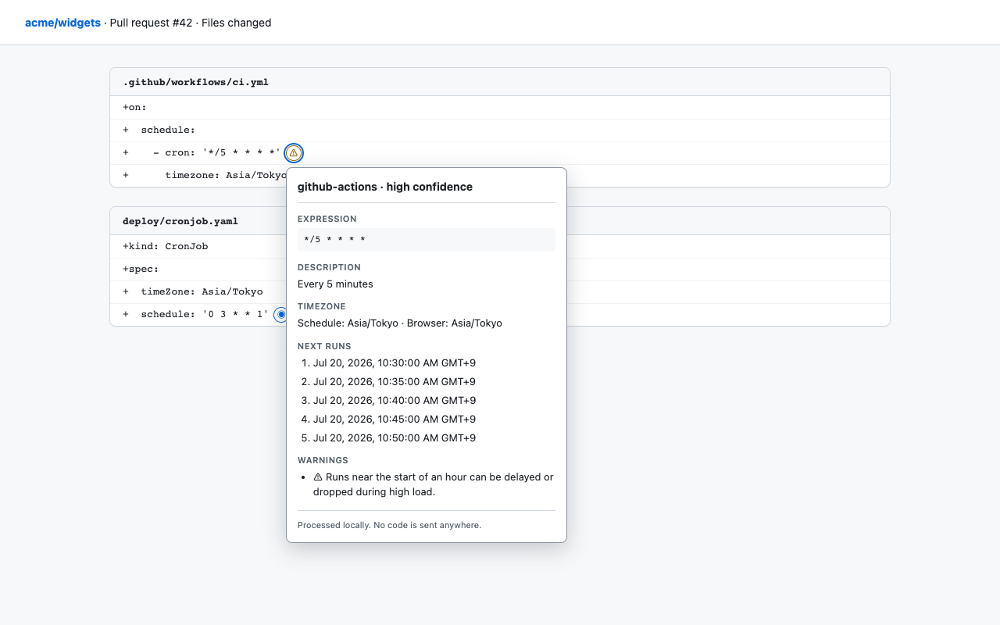

# Cron Dialect Lens

[](https://github.com/50ra4/cron-dialect-lens/actions/workflows/ci.yml)
[](./LICENSE)

**English** | [日本語](./docs/README.ja.md)

Cron Dialect Lens is a Manifest V3 Chrome extension that explains cron
schedules directly in GitHub YAML views. It distinguishes GitHub Actions from
Kubernetes CronJob semantics, shows timezone-aware upcoming runs, and flags
platform-specific mistakes without sending repository content anywhere.

This project was derived from
[`50ra4/crx-vite-ts-react-template` v1.0.0](https://github.com/50ra4/crx-vite-ts-react-template/releases/tag/v1.0.0).
English is the canonical documentation.



## Features

- Detects `cron:` and `schedule:` in GitHub YAML blob pages and pull request
  **Files changed** views.
- Identifies `github-actions`, `kubernetes`, or `unknown-posix` without
  overstating incomplete diff context.
- Displays a natural-language description, effective schedule timezone,
  browser timezone, and the next five runs.
- Warns about GitHub Actions intervals below five minutes, unsupported macros,
  and top-of-hour delays.
- Honors GitHub Actions `timezone:` and Kubernetes `.spec.timeZone`.
- Refuses to invent Kubernetes run times when `.spec.timeZone` is absent and
  rejects `TZ=` / `CRON_TZ=` inside `spec.schedule`.
- Supports hover, focus, click, Escape, and outside-click interactions.
- Handles GitHub SPA navigation and delayed diff rendering with one debounced,
  idempotent `MutationObserver`.

## Scope and limitations

Supported pages:

- `https://github.com/{owner}/{repo}/blob/{ref}/{path}` for `.yml` / `.yaml`
- `https://github.com/{owner}/{repo}/pull/{number}/files`

Supported dialects are GitHub Actions five-field cron and Kubernetes CronJob
five-field cron plus its documented macros. AWS EventBridge, Quartz, Azure,
GCP, GitHub Enterprise, raw/edit/commit pages, YAML editing, API access, and
cluster access are intentionally out of scope.

GitHub's DOM is not a public API. The adapter uses multiple conservative
strategies and stops without changing the page when it cannot recover code
lines. A collapsed PR diff can omit the context needed to identify a dialect;
such schedules are shown as `unknown-posix`.

## Privacy and permissions

All analysis happens inside the content script. The extension has:

- content-script match: `https://github.com/*`
- Chrome API permissions: none
- host permissions: none
- background service worker: none
- popup/options pages: none
- saved data: none
- external requests, analytics, or crash reporting: none

Uninstalling leaves no extension data behind because the extension stores
nothing. See the [privacy policy](./docs/privacy.md) and
[Web Store permission explanation](./docs/web-store-permissions.md).

## Development

Requirements: Node.js 24 or later and Chromium for E2E tests.

```sh
npm ci
npm run dev
```

Load the generated `dist/` directory from `chrome://extensions` using **Load
unpacked**. Production output is written to `extension/`:

```sh
npm run build
npm run verify:full
npm run package
```

`npm run verify:full` runs types, lint, all Vitest suites, a production build,
manifest privilege assertions, and a real-Chromium extension flow. Manual
acceptance steps are in [docs/manual-test.md](./docs/manual-test.md).

## Architecture

```text
src/
├── entrypoints/content/
│   ├── github/            # GitHub DOM adapter and saved HTML fixtures
│   ├── cronLens.tsx       # injection, observer, lifecycle, Shadow DOM host
│   └── CronLensPanel.tsx  # presentation only
└── lib/cron/              # extraction, dialect rules, analysis, timezones
```

The dependency direction is `entrypoints → lib`. Domain analysis is tested
without GitHub DOM state. DOM selectors are isolated in the adapter. Runtime
dependencies (`cron-parser`, `cronstrue`, React) are bundled with the extension;
no CDN or remote code is used.

## Release material

- [Manual test plan](./docs/manual-test.md)
- [Privacy policy](./docs/privacy.md)
- [Store listing copy](./docs/store-listing.md)
- [Third-party notices](./docs/third-party-notices.md)
- [Requirements traceability](./docs/requirements-traceability.md)
- [Release procedure](./docs/releasing.md)

## License

[MIT](./LICENSE). Third-party runtime licenses are listed in
[docs/third-party-notices.md](./docs/third-party-notices.md).
